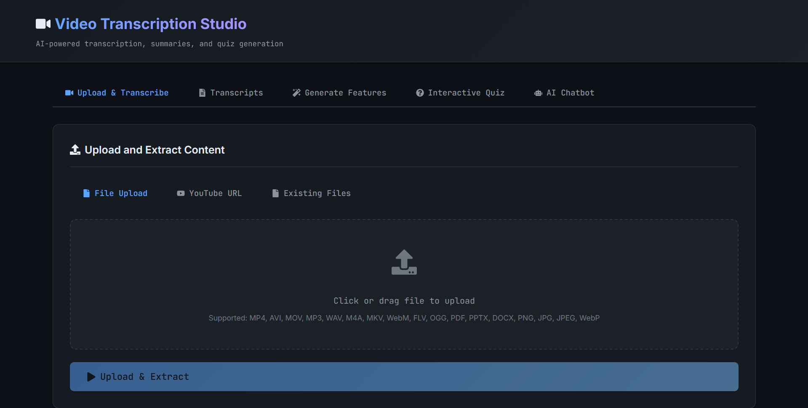

# Video Transcription & Analysis Studio



An advanced Full-Stack application (React + Flask) for transcribing videos, generating LaTeX summaries, creating podcasts, and running interactive quizzes. This project utilizes local LLMs (Ollama) and cloud APIs (OpenRouter) to provide deep insights into educational content.

## 🚀 Features

-   **Multi-Format Support**: Upload Video/Audio (MP4, MP3, WAV), Documents (PDF, PPTX, DOCX), or download directly from YouTube.
-   **Advanced Transcription**: Uses OpenAI Whisper for accurate speech-to-text.
-   **Intelligent Summarization**: Generates comprehensive LaTeX summaries using LLMs (Gemini 2.5 Flash Lite).
-   **PDF Generation**: Compiles LaTeX summaries into professional PDFs automatically.
-   **Podcast Generation**: Converts transcripts into engaging, multi-speaker style podcast scripts and audio (using Kokoro TTS).
-   **Interactive Quizzes**: Generates quizzes from content to test understanding.
-   **Remote Access**: configured for access via Tailscale/VPN.

## 🛠️ Prerequisites

Before you begin, ensure you have the following installed:

1.  **Python 3.10+**: [Download Python](https://www.python.org/downloads/)
    *   *Note*: Anaconda or Miniconda is recommended for environment management.
2.  **Node.js (v18+)**: [Download Node.js](https://nodejs.org/)
    *   Required for the React Frontend.
3.  **Ollama**: [Download Ollama](https://ollama.com/)
    *   Required for local LLM inference.
    *   **Pull the default model**: `ollama pull gpt-oss`
4.  **FFmpeg**: [Download FFmpeg](https://ffmpeg.org/download.html)
    *   **Crucial**: Add `ffmpeg/bin` to your System PATH environment variable.
5.  **MiKTeX / TeX Live**: [Download MiKTeX](https://miktex.org/download)
    *   Required for compiling generated LaTeX code into PDFs.
    *   Ensure `pdflatex` is in your System PATH.

## 📦 Installation

### 1. Backend Setup

It is recommended to use a virtual environment (Conda or venv).

```bash
# Option A: Using Conda (Recommended)
conda create -n whisper_env python=3.10
conda activate whisper_env

# Option B: Using venv
python -m venv venv
# Windows
.\venv\Scripts\activate
# Mac/Linux
source venv/bin/activate
```

Install the required Python dependencies:

```bash
# Install backend specific requirements
pip install -r backend/requirements.txt

# Install root requirements (for shared utilities)
pip install -r requirements.txt
```

*Note: Ensure `torch` is installed with CUDA support if you have an NVIDIA GPU for faster transcription.*

### 2. Frontend Setup

Navigate to the frontend directory and install dependencies:

```bash
cd frontend
npm install
```

## ⚙️ Configuration

### LLM Provider Settings
The application supports both **Ollama** (Local) and **OpenRouter** (Cloud).

1.  **OpenRouter API Key**:
    *   Get your API key from [OpenRouter](https://openrouter.ai/).
    *   Create a `.env` file in the root directory.
    *   Add your key: `OPENROUTER_API_KEY=your_key_here`

-   **File**: `utils_llm.py` handles the logic, loading the key from `.env`.
-   **Ollama**: Defaults to `http://localhost:11434`.

### Remote Access (Tailscale)
The application is configured to work over a tailored domain (e.g., `home3.localhost.rodeo`) or Tailscale IP.
-   **File**: `frontend/vite.config.js`
-   **Settings**: `allowedHosts` and `hmr` settings are pre-configured. Adjust `host` IP if your Tailscale IP changes.

## 🚀 Running the Application

### Option 1: One-Click Script (Windows)

Simply double-click the `run_app.bat` file in the root directory.
This will:
1.  Activate the `whisper_env` conda environment.
2.  Start the Flask Backend (Port 5000).
3.  Start the Vite Frontend (Port 3000).

### Option 2: Manual Start

**Terminal 1 (Backend):**
```bash
conda activate whisper_env
cd backend
python app.py
```

**Terminal 2 (Frontend):**
```bash
cd frontend
npm run dev
```

Access the application at: `http://localhost:3000`

## 📂 Project Structure

```
├── backend/                # Flask API Server (Legacy/Optional)
│   ├── app.py              # Main API entry point
│   ├── media/              # Temporary storage for uploads
│   └── requirements.txt    # Backend dependencies
├── frontend/               # React Frontend (Vite) (Legacy/Optional)
│   ├── src/                # React Source Code
│   ├── vite.config.js      # Vite Configuration
│   └── package.json        # Frontend dependencies
├── media/                  # Shared Media Storage (Audio/Video)
├── quiz/                   # Generated JSON Quizzes
├── render/                 # Generated PDFs and TeX files
├── transcript/             # Generated Transcripts and OCR text
├── TTS/                    # Generated Podcast Audio
├── .env                    # Environment variables (API Keys) - DO NOT COMMIT
├── .gitignore              # Git ignore rules
├── main.py                 # Streamlit Application Entry Point
├── utils_llm.py            # LLM Logic (Ollama/OpenRouter)
├── utils_llm_quiz.py       # Quiz Generation Logic
├── utils_ocr.py            # OCR Logic (PDF/Images)
├── utils_processing.py     # Unified Media Processing (Whisper/FFmpeg)
├── utils_storage.py        # File Management Utility
├── run_app.bat             # Windows Startup Script (Flask/React)
└── requirements.txt        # Root dependencies
```

## 📝 Common Issues & Fixes

-   **"FFmpeg not found"**: Ensure the `bin` folder of your FFmpeg installation is added to your System Environment Variables (PATH).
-   **"pdflatex not found"**: Install MiKTeX and ensure it's in your PATH. Restart your terminal after installing.
-   **"Ollama connection failed"**: Ensure Ollama is running (`ollama serve`) and the model `gpt-oss` is pulled.
